# Fileverse Demo Flow

This is the actual Fileverse receipt flow implemented in BitSend today.

## What the demo shows

- A transfer finishes in BitSend and produces a receipt screen.
- The user taps `Save to Fileverse`.
- BitSend uploads the receipt through the backend.
- The backend returns a stable public archive link immediately.
- The backend then finishes Fileverse sync in the background.
- The app refreshes and upgrades the receipt state from `Archived by Bitsend` to `Saved in Fileverse` when Fileverse finishes.

## End-to-end flow

```mermaid
flowchart LR
  A["Transfer completed in BitSend"] --> B["Receipt screen"]
  B --> C["Tap Save to Fileverse"]
  C --> D["GET /health"]
  D --> E["Capture receipt PNG"]
  E --> F["Compress until <= 420 KB"]
  F --> G["POST /v1/fileverse/session"]
  G --> H["POST /v1/fileverse/receipts"]
  H --> I["Worker stores archive in Durable Object"]
  I --> J["Return worker archive link immediately"]
  J --> K["App saves metadata locally and copies link"]
  I --> L["Background Fileverse publish"]
  L --> M["ddoc success or legacy upstream success"]
  M --> N["GET /v1/fileverse/receipts/:id refresh"]
  N --> O["UI shows Saved in Fileverse + Fileverse link"]
```

## App flow

1. Complete a transfer and land on the send success screen or receive result screen.
2. The receipt screen shows `Save image` and `Save to Fileverse`.
3. When the user taps `Save to Fileverse`, the app:
   - checks backend health
   - captures the receipt widget as PNG
   - reduces image size until it fits the Fileverse upload limit
   - creates a Fileverse backend session if needed
   - sends transfer metadata plus the receipt PNG to the backend
4. The app stores the returned receipt id, receipt URL, saved time, storage mode, and message in the local transfer record.
5. The returned link is copied to the clipboard automatically.
6. If the first response is still worker-backed, the app polls the backend again and updates the receipt when Fileverse sync finishes.

## Backend flow

1. `POST /v1/fileverse/session`
   - creates a backend session token
   - the app uses that token as `Authorization: Bearer ...`
2. `POST /v1/fileverse/receipts`
   - validates the payload
   - creates a Worker-hosted archive id and public archive URL
   - stores the full receipt record in the Durable Object
   - returns the Worker archive response immediately
3. In the background, the Worker tries the real Fileverse publish path:
   - first: Fileverse ddoc publish with `FILEVERSE_API_KEY` and `FILEVERSE_DDOCS_ENDPOINT`
   - fallback: legacy upstream publish with `FILEVERSE_RECEIPT_UPSTREAM`
4. On success, the Durable Object record is updated to:
   - `storageMode: fileverse`
   - Fileverse ddoc id
   - Fileverse share link
5. On failure or missing config, the receipt stays in:
   - `storageMode: worker`
   - Worker archive link remains valid

## What to show in the demo

## Phase 1: Immediate response

- Finish a transfer.
- Open the receipt screen.
- Tap `Save to Fileverse`.
- Call out the progress text:
  - `Checking backend...`
  - `Backend v... ready. Encrypting receipt...`
  - `Publishing encrypted receipt to Fileverse...`
- Show that the app immediately copies a public receipt link.
- Open the link if needed and show the Worker-hosted receipt page with:
  - receipt metadata
  - sender and receiver
  - transaction link if present
  - embedded receipt image

## Phase 2: Final Fileverse state

- Open the transfer detail or wait on the receipt screen.
- After refresh, show:
  - `Saved in Fileverse`
  - `Fileverse ID`
  - `Fileverse link`
  - `Copy Fileverse link`
- This is the point where the backend has swapped from the Worker archive response to the Fileverse-backed response.

## Success states

### Best-case Fileverse success

- `Receipt provider`: `Saved in Fileverse`
- `Fileverse ID` is shown
- `Fileverse link` is shown
- Receipt note says it was saved to Fileverse as an encrypted ddoc

### Acceptable fallback demo

- `Receipt provider`: `Archived by Bitsend`
- `Archive ID` is shown
- `Receipt link` is shown
- Receipt note explains that Fileverse sync is still running or not configured

This fallback is still a working demo of the product flow because the public archive link is valid and the backend is designed to return it immediately.

## Config required for full Fileverse mode

For a true Fileverse-backed demo, configure these Worker variables:

- `FILEVERSE_API_KEY`
- `FILEVERSE_DDOCS_ENDPOINT`

Optional fallback path:

- `FILEVERSE_RECEIPT_UPSTREAM`

The example file is `backend-worker/.dev.vars.example`.

If these values are missing, the app will still work, but the demo will stop at the Worker archive state instead of upgrading to `Saved in Fileverse`.

## Demo checklist

- Use `Local` wallet mode for the clearest flow.
- Complete a nearby handoff over hotspot or BLE.
- Use the receipt screen after transfer completion.
- Tap `Save to Fileverse`.
- Show the copied link.
- Refresh or open transfer detail until the provider becomes `Saved in Fileverse`.

## Notes

- The app currently defaults to the deployed Worker backend endpoint, but it can be changed in Settings.
- The current UI copy is `Save to Fileverse`.
- Some older widget tests still expect the older label `Save receipt online`.
